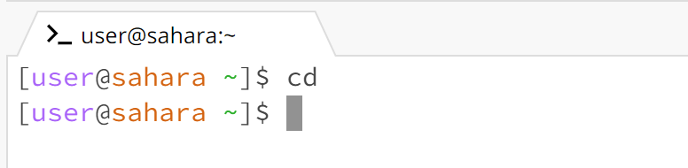
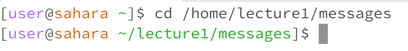
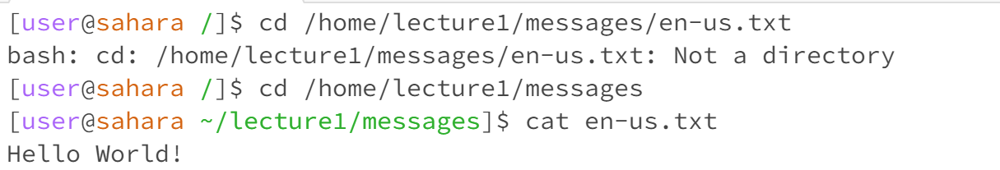
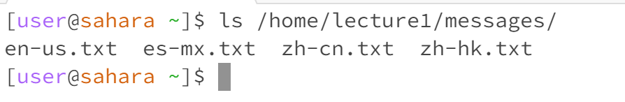
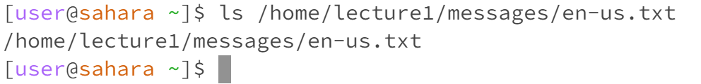
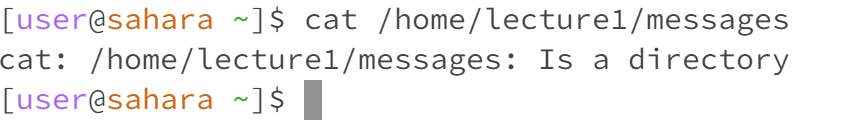

# Lab report 1
## CD command with no arguments

---
```
* What the working directory was when the command was run:
   /home
```
```
*A sentence or two explaining why you got that output 
   CD command that without arguments is to take me back to my home directory,providing a
   convenient way to return to my starting point within the file system.
```
```
*Indicate whether the output is an error or not
   This is not an error
```
## CD command with a path to a directory as an argument

```
* What the working directory was when the command was run:
      /home
```
```
*A sentence or two explaining why you got that output 
   CD command successfully changed your working directory to the /home/lecture/messages
   directory,because the output is indicated by the filesystem and the specific path as
   an argument
```
```
*Indicate whether the output is an error or not
   This is not an error
```
## CD command with a path to a file as an argument

```
* What the working directory was when the command was run:
   is the root directory when I run with the path of the files. but then I change
   to the /home/lecture1/messages and use cat command to run the .txt file.
```
```
*A sentence or two explaining why you got that output 
   the reason why I getting an error because the cd command is designed to change
   my current working directory to a directory,not a file.
```
```
*Indicate whether the output is an error or not
   This is an error because is designed to change my current working directory to a
   directory,but not for change the files.
```
---
---
## LS command with no arguments

```
* What the working directory was when the command was run
   /home
```
```
*A sentence or two explaining why you got that output 
   The output lists the contents of the /home directory. Because
   This is the default behavior of the ls command.
```
```
*Indicate whether the output is an error or not
   this is not an error.
```
## LS command with a path to a directory as an argument.

```
* What the working directory was when the command was run
   /home
```
```
*A sentence or two explaining why you got that output 
   The output display the /home/lecture1/messages, allowing me to see the files and
   subdirectories within this directory. 
```
```
*Indicate whether the output is an error or not
   this is not an error.
```
## LS command with a path to a file as an argument.

```
* What the working directory was when the command was run
   /home
```
```
*A sentence or two explaining why you got that output 
   ls command is to list the contents of directories, not individual files, is
   treated as a directories, and attempting  to use it as an argument
```
```
*Indicate whether the output is an error or not
   this is an error because is to list the contents of directories,
   not individual files.
```
---
---
## CAT command with no argument

```
* What the working directory was when the command was run
   /home
```
```
*A sentence or two explaining why you got that output 
   when I used the cat command with no argument, it waits for my input from the keyboard.
   the system won't sotp until I giving the input. or we can just ctrl+C to stop running.
```
```
*Indicate whether the output is an error or not
   this is not an error.
```

## CAT command with a path to a directory as an argument.

```
* What the working directory was when the command was run
   /home
```
```
*A sentence or two explaining why you got that output 
   The cat command is used to display the text files not a directory,therefor
   I have this out put
```
```
*Indicate whether the output is an error or not
   this is an error because /home/lecture1/messages that indicate the
   messages is an directory not an file, and cat command is to display
   the contents of the text files.
```
## CAT command with a path to a files as an argument.

```
* What the working directory was when the command was run
   /home
```
```
*A sentence or two explaining why you got that output 
   when I run the cat command with a path of files as an argument, the command display the
   content of the file located at  /home/lectre1/messages/en-us.txt The output reflects the
   text of this file which "Hello Wrold!"
```
```
*Indicate whether the output is an error or not
   this is not an error.
```
---
---
