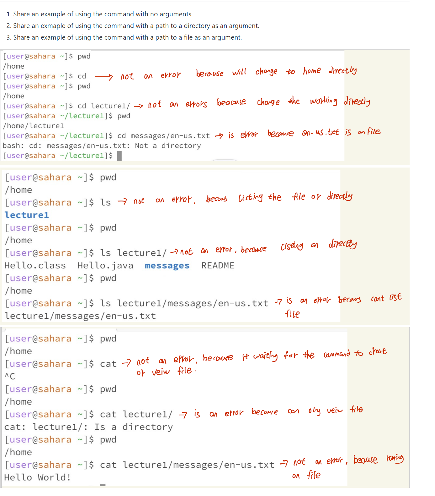

# Lab report 1

---
```
CD command:
* With no argument, the cd command will automatically go back to the home directory.
* If use the cd command on the file, it will result error because it has to operate on a directory.
```
---
```
LS command:
*Using the ls command with no argument will not result in an error because will only
   list the available file or directory in the working directory. 
*But when using the ls command to ls a .txt file will result error, because inside the
   .txt file will not have any file or directory, thus will have an error. 
```
---
```
Cat command:
* When using cat command with no argument will not result in an error because
  will wait for the command to create or view the file or directory.
* When using cat command with the file path argument will result,
  because can not create or view files in the txt file.
```
