## Lab Report 4

* Log into ieng6
 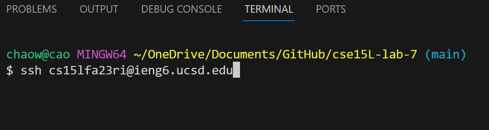

  I typ `ssh cs15lfa23ri@ieng6.ucsd.edu` `<enter>`
  in my local computer's command line inorder to accessing the ieng6 machanin

 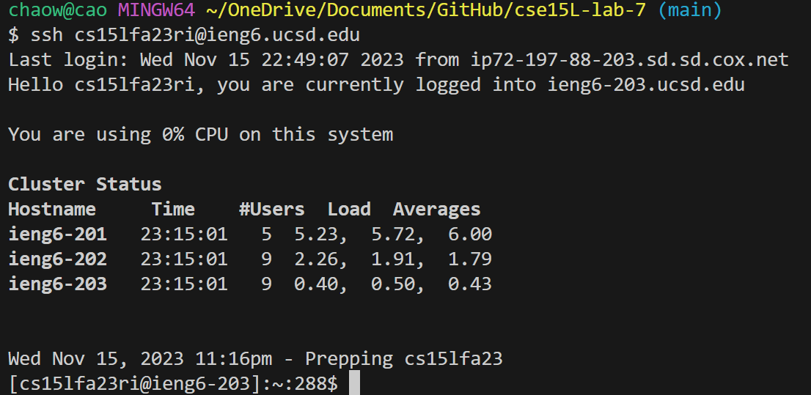
Above showed that I have successfully login my ieng6 machanin

Effect: This allowed the user to remotely log into the ieng6 machine at UCSD.

---

* Clone your fork of the repository from your Github account (using the SSH URL)
  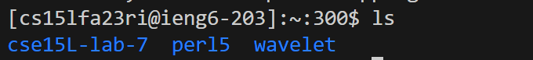

  I type `ls` `<enter>` this command show me what are the files in and make sure
  I am at the correct current working directory

  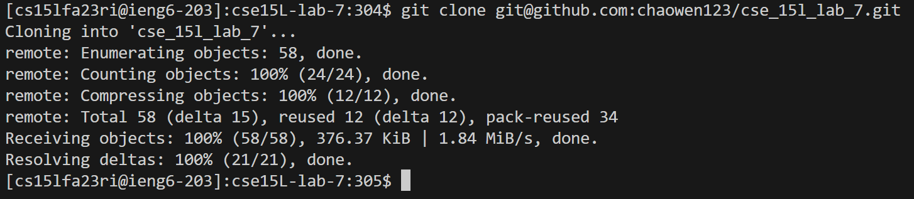
  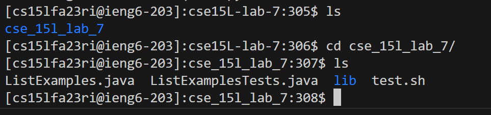
  Then I use `cd` to change my working directory to cse15L-lab-7
  Then I type `git clone` after finish downloading, then 
  I typ `ls` to make sure that I am in the correct working directory

  Effect: This changed the working directory to cse15L-lab-7 and  cloned the specified repository 
  into the current directory.

---
* Run the tests, demonstrating that they fail
  I type `bash test.sh` to run the test 
  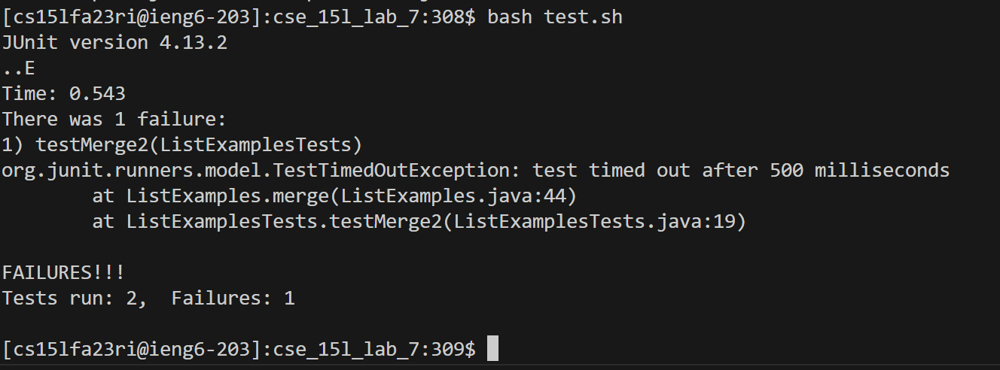

  Effect: Executed the test script to run tests, which initially failed.

---
* Edit the code file to fix the failing test
  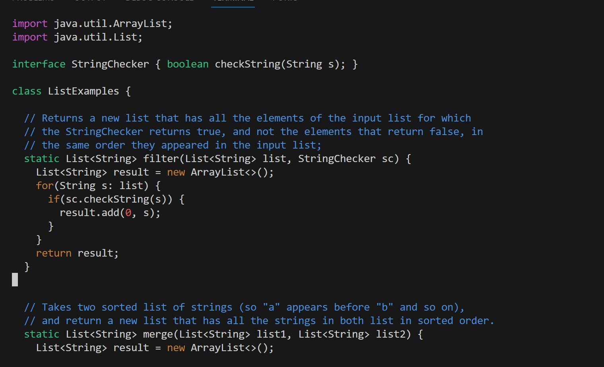
   I type `vim ListExamples.java` to access the vim mode 

  
    then I type `?index1` to locate the code where I want to fix

  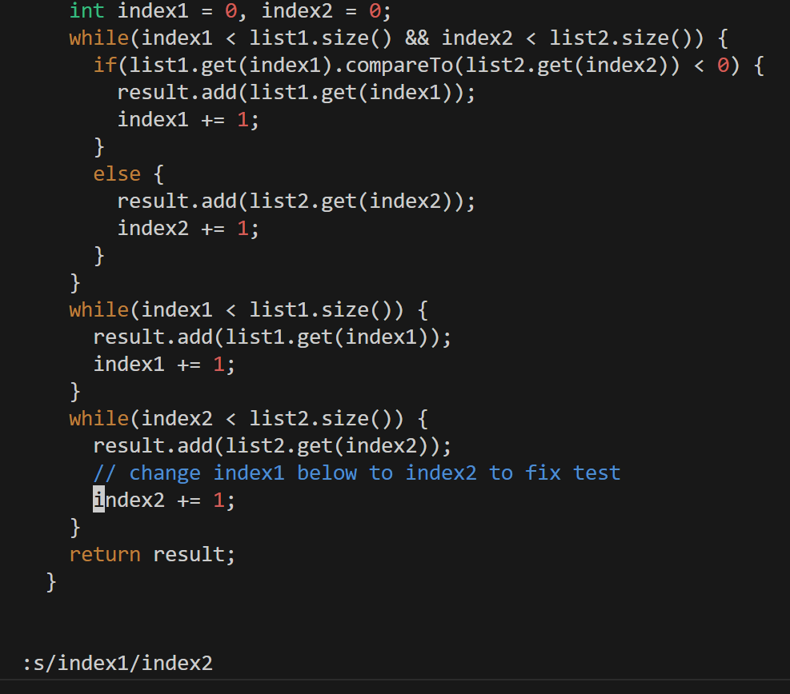
    then I press `<down>` `<down>` `<down>` `<down>` `<down>` `<down>` `<down>` `<down>` `<down>` `<down>`
    type `s/index1/index2` to fix the code.Then I type `:wq`to save my change.

  Effect: Opened the file ListExamples.java in vim editor, navigated to a specific code section, replaced
  index1 with index2, and saved the changes to fix the failing test.

  ---
* Run the tests, demonstrating that they now succeed
    I type `bash test.sh` again to run the ListExample to
       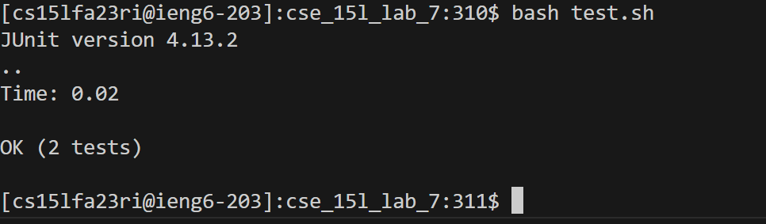

  Effect: Ran the test script again, this time the tests succeeded due to the code fix.

  ---
* Commit and push the resulting change to your Github account (you can pick any commit message!)
    Then I type`git status` to check what files that I have made the change
    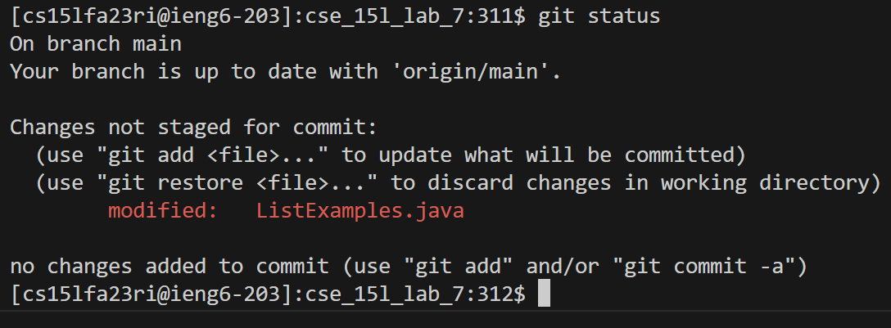
    Then I type `git add ListExamples.java` to add the files to
    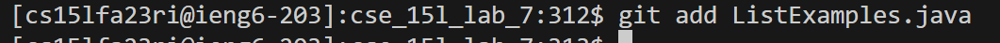
    Then I type `git commit -m "change index1 to index2"` to make the commit
    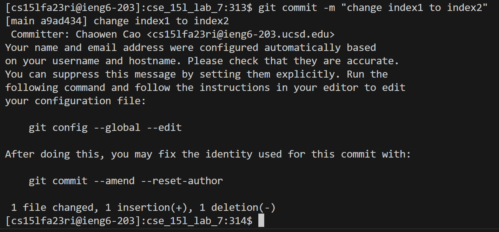
    Then I type `git push origin main` to make the change on my github account
    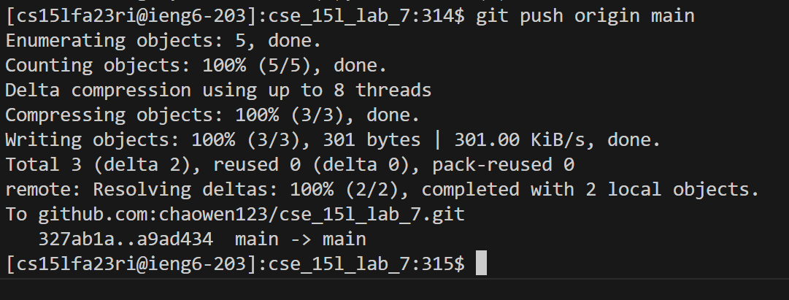

  Effect: These commands collectively added the changed file to the git staging area, committed the
  change with a descriptive message, and then pushed the commit to the main branch of the user's
  GitHub repository.

  ---
  **summarily**
  
  These steps demonstrate a typical workflow in software development, including accessing remote machines,
  navigating and modifying the file system, version control operations, code editing, and testing.
