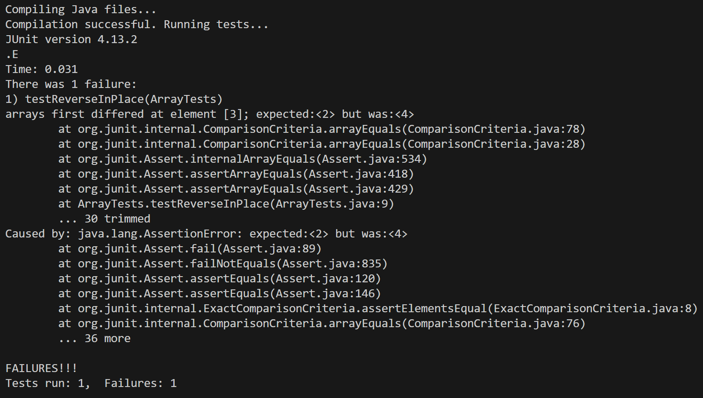
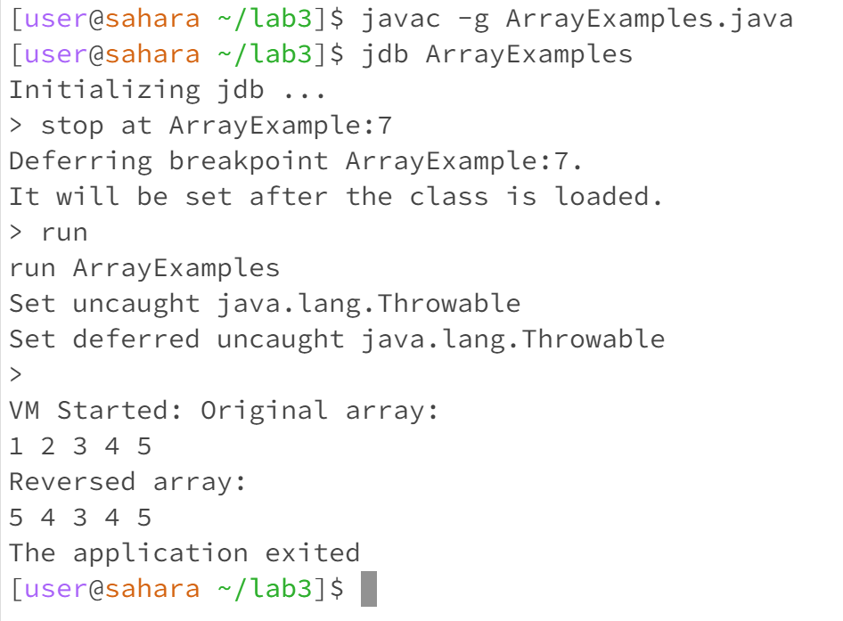
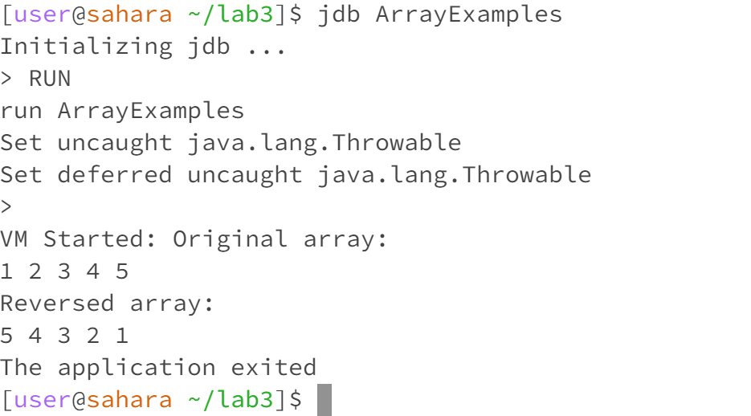
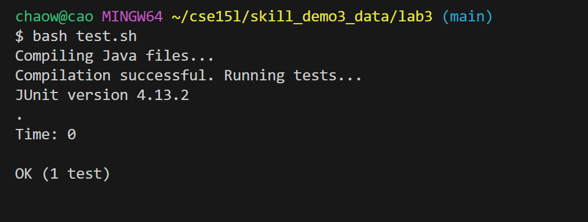

## Lab Report 5
---

**Part 1**

1.The original post from a student with a screenshot showing a symptom and a description of a guess at 
the bug/some sense of what the failure-inducing input is.
```
Title: Trouble with Array Reversal Function in Java

Hello,

I'm trying to reverse an array in place using the `reverseInPlace(int[] arr)` method.
However, the method doesn't seem to be working correctly. it does not getting the test pass.
```

* Here is my reverseInplacae method
```
public class ArrayExamples {

  // Changes the input array to be in reversed order
  static void reverseInPlace(int[] arr) {
    for(int i = 0; i < arr.length; i += 1) {
      arr[i] = arr[arr.length - i - 1];
    }
  }
}
```

* Here is my test files
```
import static org.junit.Assert.*;
import org.junit.*;

public class ArrayTests {
	@Test 
	public void testReverseInPlace() {
    int[] input1 = { 1,2,3,4,5 };
    ArrayExamples.reverseInPlace(input1);
    assertArrayEquals(new int[]{ 5,4,3,2,1 }, input1);
	}
}
```

* Here is my symptom


---
2.A response from a TA asking a leading question or suggesting a command to try 
```
Hi,

It looks like there could be an issue with your loop logic in reverseInPlace(int[] arr).
Can you add debug prints inside the loop to show the value of arr[i] and arr[arr.length - i - 1]
before and after the swap at each iteration? This should help us see what's happening during each step of
the reversal process.
```

---
3.Another screenshot/terminal output showing what information the student got from trying that, 
and a clear description of what the bug is.

```
public class ArrayExamples {

  // Changes the input array to be in reversed order
  static void reverseInPlace(int[] arr) {
    for(int i = 0; i < arr.length; i += 1) {
      arr[i] = arr[arr.length - i - 1];
    }
  }
 public static void main(String[] args) {
    int[] arr = {1, 2, 3, 4, 5}; // Example array

    System.out.println("Original array:");
    for(int value : arr) {
        System.out.print(value + " ");
    }

    reverseInPlace(arr); // Reversing the array

    System.out.println("\nReversed array:");
    for(int value : arr) {
        System.out.print(value + " ");
    }
}

}
```
Student: I create the main function inside my ArrayExamples.java and then use the java 
debugger to run the function to see what is the actual output.



Here is my output when I use the jdb. Based on the output I have, 
I think that my logic is that the array does not swap correctly.

---
4.At the end, all the information needed about the setup including:
* The file & directory structure needed
```
public class ArrayExamples {

  // Changes the input array to be in reversed order
  static void reverseInPlace(int[] arr) {
    for(int i = 0; i < arr.length; i += 1) {
      arr[i] = arr[arr.length - i - 1];
    }
  }
```
the above code is my buggy files

```
import static org.junit.Assert.*;
import org.junit.*;

public class ArrayTests {
	@Test 
	public void testReverseInPlace() {
    int[] input1 = { 1,2,3,4,5 };
    ArrayExamples.reverseInPlace(input1);
    assertArrayEquals(new int[]{ 5,4,3,2,1 }, input1);
	}
}
```
the above code my test files

```
set -e
echo "Compiling Java files..."
javac -cp ".;lib/hamcrest-core-1.3.jar;lib/junit-4.13.2.jar" *.java

# Check if compilation was successful
if [ $? -eq 0 ]; then
    echo "Compilation successful. Running tests..."
    # Running the JUnit tests
    java -cp ".;lib/junit-4.13.2.jar;lib/hamcrest-core-1.3.jar" org.junit.runner.JUnitCore ArrayTests
else
    echo "Compilation failed."
fi
```
the above code is my test.sh

  
* The contents of each file before fixing the bug
```
public class ArrayExamples {

  // Changes the input array to be in reversed order
  static void reverseInPlace(int[] arr) {
    for(int i = 0; i < arr.length; i += 1) {
      arr[i] = arr[arr.length - i - 1];
    }
  }
```
the above code is my buggy files

* The full command line (or lines) you ran to trigger the bug


* A description of what to edit to fix the bug
```
  static void reverseInPlace(int[] arr) {
    int temp=0;
    int length = arr.length-1;

    for(int i = 0; i < arr.length/2; i++) {
         temp = arr[i];
         arr[i]=arr[length];
         arr[length]=temp;
         length--;
    }
  }
```
Student:I modify the loop in reverseInPlace(int[] arr) to correctly swap 
elements without affecting the same element twice.


above image show that I have fix the bug.



above image show that I have also pass the test.

---
**Part 2**
