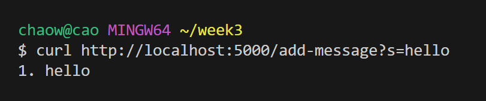
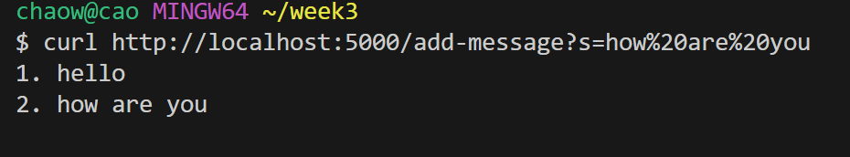
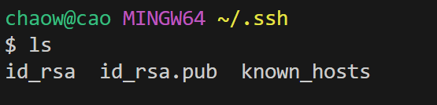
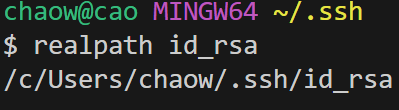
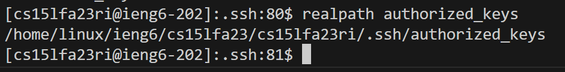
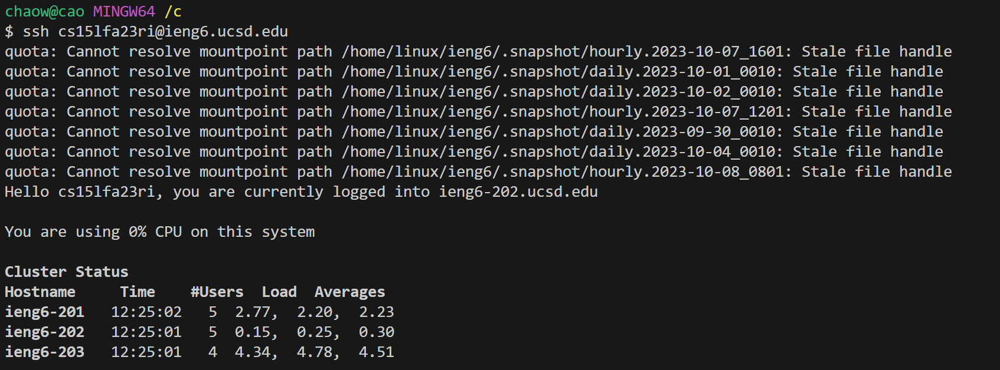
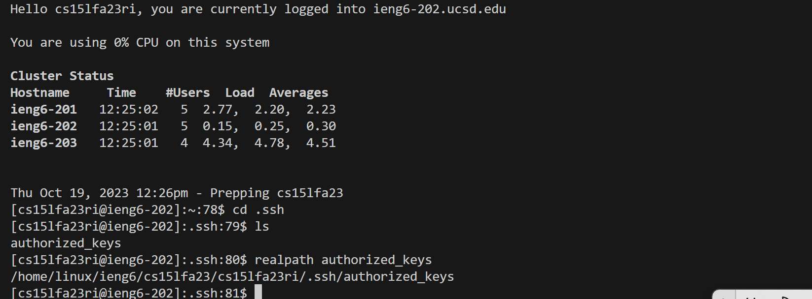

## Lab Report2 
---

## Part 1
* Show the code for my StringServer.java
---
---
```
import java.io.IOException;
import java.net.URI;
import java.util.ArrayList;
import java.util.List;
class Handler implements URLHandler {
    // The one bit of state on the server: a number that will be manipulated by
    // various requests.
    int num = 0;
    List<String> strings = new ArrayList<>();
    public String handleRequest(URI url) {
        if (url.getPath().equals("/")) {
            return " ";
        } else {
            if (url.getPath().contains("/add-message")) {
                String[] parameters = url.getQuery().split("=");
                if (parameters[0].equals("s")) {
                    String addString = parameters[1]; 
                    if(!strings.contains(addString))
                    {
                        strings.add(parameters[1].replace("+"," "));
                    }
                    StringBuilder output = new StringBuilder();
                   for (int i = 0; i < strings.size(); i++) {
                        output.append((i + 1) + ". " + strings.get(i) + "\n");
                    }
                    return output.toString();
                    
                }
            }
            return "404 Not Found!";
        }
    }
}
class StringServer {
    public static void main(String[] args) throws IOException {
        if(args.length == 0){
            System.out.println("Missing port number! Try any number between 1024 to 49151");
            return;
        }
        int port = Integer.parseInt(args[0]);
        Server.start(port, new Handler());
    }
}
```
---
---
* /add-messages?=hello



1.Which methods in your code are called?
- StringServer.main(String[] args):This is the starting point when running Java programs.
It checks if the port number is provided as a parameter. If so, it will start the server
on that port using the given handler
- Handler.handleRequest(URI url): This method will be invoked when a request comes in. The
method checks the path of the URL and processes it accordingly.

2.What are the relevant arguments to those methods, and the values of any relevant fields of the class?
- StringServer.main(String[] args):args: This is the array of command-line arguments passed to the
main method.
- Handler.handleRequest(URI url): url: This is the URI representing the incoming request.

3.How do the values of any relevant fields of the class change from this specific request? If no value
got changed, explain why.
* Field: num.
* Change: No change.
* Reason: The num field is not referenced or modified anywhere in the provided code for the specified
  request.It remains initialized at 0.
* Field: strings.
* Initial Value: An empty list []
* Change: After processing the request /add-message?s=Hello, the strings list will have one string
element.
* Reason:The code checks if the URL path contains /add-message.It then processes the query string
to extractthe parameter associated with thekey s.The value of this parameter is checked against
the existing elements of the strings list to avoid duplicates.As the list is initially empty,
the string Hello is added to the list. 


---
* /add-messages?=how are you


1.Which methods in your code are called?
- StringServer.main(String[] args):This is the starting point when running Java programs.
It checks if the port number is provided as a parameter. If so, it will start the server
on that port using the given handler.

- Handler.handleRequest(URI url): This method will be invoked when a request comes in. The
method checks the path of the URL and processes it accordingly.

2.What are the relevant arguments to those methods, and the values of any relevant fields
    of the class?
- Handler.handleRequest(URI url): url: This is the URI of the incoming request.
- StringServer.main(String[] args):args: This is the array of command-line arguments passed to the
main method.

3.How do the values of any relevant fields of the class change from this specific request?
If no values got changed,explain why.
* field: num.
* Change: No change.
* Reason: The num field is not referenced or modified anywhere in the provided code for this request.
* Field:strings
* Change: After processing the request /add-message?s=how+are+you, the string "how are you" will be
added to the strings list..
* Reason:The code checks if the URL path contains /add-message.It then processes the query string
to extract the parameter associated with the key s.The value "how are you" is extracted from the
query string.The code checks if this string is already in the strings list to avoid duplicates. If
not already present, it gets added to the list


## Part 2
1.The path to the private key for your SSH key for logging into ieng6 (on your computer 
or on the home directory of the lab computer)


the Image show that path to the private key: **/c/Users/chaow/.ssh/id_rsa**

2.The path to the public key for your SSH key for logging into ieng6 (within your account on ieng6)


the Image show that path to the public key:**/home/linux/ieng6/cs15lfa23/cs15lfa23ri/.ssh/authorized_keys**

3.A terminal interaction where you log into ieng6 with your course-specific account 
without being asked for a password.




## Part 3
```
*In a couple of sentences, describe something you learned from lab in week 2 or 3 that you
didn’t know before.

-I have learned what are the differences between the private key and the public key.
Wich, we could send our public key to the remote server because this key is encrypted.
also, I have learned how to build my own server by using the sample httpserver.HttpHandler.
The code sets up a simple HTTP server that can accept with paths like "/add-messages?s=message"
to add messages to a list and return a numbered list of all messages. It keeps track of
these messages in stringlist. If the path is "/", it returns an empty space.
```
