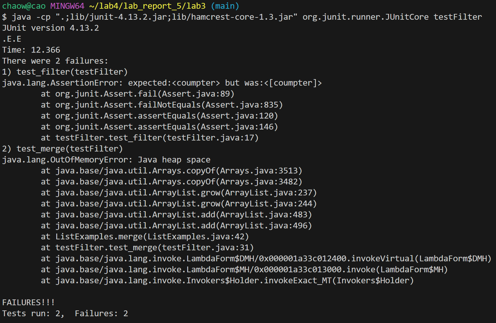
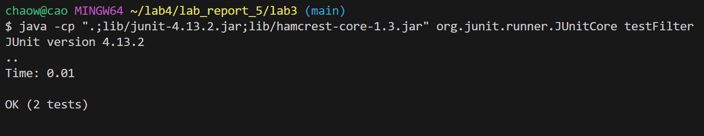

## Lab Report 3

**Part I**
* A failure-inducing input for the buggy program, as a JUnit test and any associated code

  **this the my buggy program " listexamples"**

```
import java.util.ArrayList;
import java.util.List;

interface StringChecker {
  boolean checkString(String s);
}

class ListExamples {

  // Returns a new list that has all the elements of the input list for which
  // the StringChecker returns true, and not the elements that return false, in
  // the same order they appeared in the input list;
  static List<String> filter(List<String> list, StringChecker sc) {
    List<String> result = new ArrayList<>();
    for (String s : list) {
      if (sc.checkString(s)) {
        result.add(0, s);
      }
    }
    return result;
  }

  // Takes two sorted list of strings (so "a" appears before "b" and so on),
  // and return a new list that has all the strings in both list in sorted order.
  static List<String> merge(List<String> list1, List<String> list2) {
    List<String> result = new ArrayList<>();
    int index1 = 0, index2 = 0;
    while (index1 < list1.size() && index2 < list2.size()) {
      if (list1.get(index1).compareTo(list2.get(index2)) < 0) {
        result.add(list1.get(index1));
        index1 += 1;
      } else {
        result.add(list2.get(index2));
        index2 += 1;
      }
    }
    while (index1 < list1.size()) {
      result.add(list1.get(index1));
      index1 += 1;
    }
    while (index2 < list2.size()) {
      result.add(list2.get(index2));
      index1 += 1;
    }
    return result;
  }
}
```


   **this is my test program for the listexamoles**

```
import static org.junit.Assert.*;
import org.junit.*;
import java.util.ArrayList;
import java.util.List;

public class testFilter {
    @Test
    public void test_filter() {
        List<String> list = new ArrayList<>();
        list.add("Appl");
        list.add("Bob");
        list.add("coffe");
        list.add("Dave");
        list.add("coumpter");
        StringChecker isFourCharter = s -> s.length() == 8;
        List<String> result = ListExamples.filter(list, isFourCharter);
        assertEquals("coumpter", result);
    }
    @Test
    public void test_merge() {
        List<String> list1 = new ArrayList<>();
        list1.add("a");
        list1.add("c");
        list1.add("e");

        List<String> list2 = new ArrayList<>();
        list2.add("b");
        list2.add("d");
        list2.add("f");

        List<String> result = ListExamples.merge(list1, list2);
        assertEquals("a,c,e", result);
    }
}
```


* An input that doesn’t induce a failure, as a JUnit test and any associated code


```
import static org.junit.Assert.*;
import org.junit.*;
import java.util.ArrayList;
import java.util.List;
public class testFilter {
    @Test
    public void test_filter() {
        List<String> list = new ArrayList<>();
        list.add("Appl");
        list.add("Bob");
        list.add("coffe");
        list.add("Dave");
        list.add("coumpter");
        StringChecker isFourCharter = s -> s.length() == 8;
        List<String> result = ListExamples.filter(list, isFourCharter);
        assertEquals(result, result);
    }
    @Test
    public void test_merge() {
        List<String> list1 = new ArrayList<>();
        list1.add("a");
        list1.add("c");
        list1.add("e");

        List<String> list2 = new ArrayList<>();

        List<String> result = ListExamples.merge(list1, list2);
        assertEquals(result, result);
    }
}

```


**this is the output with no failure**
```
$ java -cp ".;lib/junit-4.13.2.jar;lib/hamcrest-core-1.3.jar" org.junit.runner.JUnitCore testFilter
JUnit version 4.13.2
..
Time: 0.01

OK (2 tests)
```

* The symptom, as the output of running the tests (provide it as a screenshot of running JUnit with at least the two inputs above)

  **this is my output that include a failure**

  

  **this is my ouput that doesn’t induce a failure**
  

* The bug, as the before-and-after code change required to fix it


  **this is before**
  
```
import java.util.ArrayList;
import java.util.List;

interface StringChecker {
  boolean checkString(String s);
}

class ListExamples {

  // Returns a new list that has all the elements of the input list for which
  // the StringChecker returns true, and not the elements that return false, in
  // the same order they appeared in the input list;
  static List<String> filter(List<String> list, StringChecker sc) {
    List<String> result = new ArrayList<>();
    for (String s : list) {
      if (sc.checkString(s)) {
        result.add(0, s);
      }
    }
    return result;
  }

  // Takes two sorted list of strings (so "a" appears before "b" and so on),
  // and return a new list that has all the strings in both list in sorted order.
  static List<String> merge(List<String> list1, List<String> list2) {
    List<String> result = new ArrayList<>();
    int index1 = 0, index2 = 0;
    while (index1 < list1.size() && index2 < list2.size()) {
      if (list1.get(index1).compareTo(list2.get(index2)) < 0) {
        result.add(list1.get(index1));
        index1 += 1;
      } else {
        result.add(list2.get(index2));
        index2 += 1;
      }
    }
    while (index1 < list1.size()) {
      result.add(list1.get(index1));
      index1 += 1;
    }
    while (index2 < list2.size()) {
      result.add(list2.get(index2));
      index1 += 1;
    }
    return result;
  }
}
```

**this after**

```
import static org.junit.Assert.*;
import org.junit.*;
import java.util.ArrayList;
import java.util.List;

public class testFilter {
    @Test
    public void test_filter() {
        List<String> list = new ArrayList<>();
        list.add("Appl");
        list.add("Bob");
        list.add("coffe");
        list.add("Dave");
        list.add("coumpter");
        StringChecker isFourCharter = s -> s.length() == 8;
        List<String> result = ListExamples.filter(list, isFourCharter);
        List<String> expect = new ArrayList<>();
        expect.add("coumpter");
        assertEquals(expect, result);
    }
    @Test
    public void test_merge() {
        List<String> list1 = new ArrayList<>();
        list1.add("a");
        list1.add("c");
        list1.add("e");

        List<String> list2 = new ArrayList<>();
        list2.add("b");
        list2.add("d");
        list2.add("f");

        List<String> result = ListExamples.merge(list1, list2);
        List<String> expect = new ArrayList<>();
        expect.add("a");
        expect.add("b");
        expect.add("c");
        expect.add("d");
        expect.add("e");
        expect.add("f");
        assertEquals(expect, result);
    }
}
```

* Briefly describe why the fix addresses the issue.
  * .Issue with filter method: The filter method is currently adding the elements that pass the check at the
    beginning of the list(result. add(0, s)). This will reverse the order of elements from the input
    list into the output list.
  * Issue with merge method: The merge method contains a bug in the second while loop that handles the
    remaindr of list2. because should increment the index2 not index1.

  
 --- 
**Part II**

1.less -N (display line numbers) (from ChatGpt)
 * `less -N ./technical/plos/file.txt`This option causes less to display line numbers at the beginning of each line
    * This command opens all the file.txt file in the ./technical/plos directory with line
      numbers displayed alongside each line. It's useful for reference and editing purposes
      when you need to refer to specific line numbers.
 * `less -N ./technical/file_log` opens the files_log file, displaying line numbers which is helpful
    when we're discussing file contents

2.less -S (chop long lines)(from ChatGpt)
 * `less -S ./technical/plos/files.log`Opens the files.log file, and long lines will not be wrapped. This is useful
   for viewing log files with long lines that might be easier to read without wrapping.
 * `less -S ./technical/plos/files.sql`With this command, less opens a SQL files where SQL statements can be
   very long, and it's often more readable to scroll sideways rather than view wrapped lines.

3.less -i (ignore case in searches) (from module lecture)
 * `less -i ./technical/README`in this example, when searching within the README file, typing
   /pattern will find ‘pattern’, ‘Pattern’, ‘PATTERN’, etc. \
 * `less -i ./technical/files.doc` When you open the files.doc file with this option, any search
   you perform inside less will be case insensitive, making it easier to find text regardless of its case

4.less -g (highlight only the last match) (from ChatGpt)
 * `less -g ./technical/files.txt` When searching within files.txt, this option will ensure that
   only the last search match is highlighted on the screen.
 * `less -g ./technical/logs/files.log` If you’re reviewing a files.log file and you want to
   highlight the most recent occurrence of an error, this option could be beneficial.

