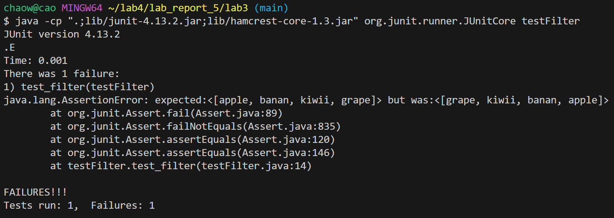
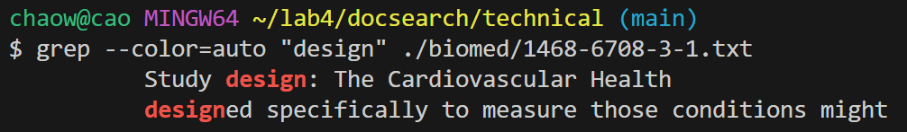
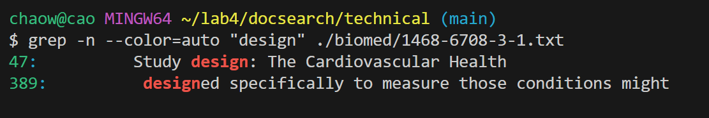

## Lab Report 3

**Part I**
* A failure-inducing input for the buggy program, as a JUnit test and any associated code

  **this the my buggy program " listexamples"**

```
import java.util.ArrayList;
import java.util.List;

interface StringChecker {
  boolean checkString(String s);
}

class ListExamples {


  static List<String> filter(List<String> list, StringChecker sc) {
    List<String> result = new ArrayList<>();
    for (String s : list) {
      if (sc.checkString(s)) {
        result.add(0, s);
      }
    }
    return result;
  }
```

  **this is my test program for the listexamoles**

```
public class testFilter {
       @Test
    public void test_filter() {
        List<String> sampleList = Arrays.asList("apple", "pie", "banan", "kiwii", "grape");
        StringChecker isFourCharter = s -> s.length() == 5;
        List<String> filteredList = ListExamples.filter(sampleList, isFourCharter);
        List<String> expect = Arrays.asList("applee", "banana", "kiwiii","grapee");
        assertEquals(expect, filteredList);
    }
```
---
* An input that doesn’t induce a failure, as a JUnit test and any associated code

```
     @Test
    public void test_filter() {
        List<String> sampleList = Arrays.asList("apple", "pie", "banan", "kiwii", "grape");
        StringChecker isFourCharter = s -> s.length() == 5;
        List<String> filteredList = ListExamples.filter(sampleList, isFourCharter);
        List<String> expect = Arrays.asList("apple", "banan", "kiwii","grape");
        assertEquals(expect, filteredList);
    }
```

---
* The symptom, as the output of running the tests (provide it as a screenshot of running JUnit with at least the two inputs above)

  **this is my output that include a failure**

  

---

* The bug, as the before-and-after code change required to fix it

  **this is before**

```
import java.util.ArrayList;
import java.util.List;

interface StringChecker {
  boolean checkString(String s);
}

class ListExamples {


  static List<String> filter(List<String> list, StringChecker sc) {
    List<String> result = new ArrayList<>();
    for (String s : list) {
      if (sc.checkString(s)) {
        result.add(0, s);
      }
    }
    return result;
  }
```
  
  **this is after**
```
import java.util.ArrayList;
import java.util.List;

interface StringChecker {
  boolean checkString(String s);
}

class ListExamples {


  static List<String> filter(List<String> list, StringChecker sc) {
    List<String> result = new ArrayList<>();
    for (String s : list) {
      if (sc.checkString(s)) {
        result.add(s);
      }
    }
    return result;
  }
```

---
* Briefly describe why the fix addresses the issue.
  * .Issue with filter method: The filter method is currently adding the elements that pass the check at the
    beginning of the list(result. add(0, s)). This will reverse the order of elements from the input
    list into the output list. Then I changed `result. add(0, s)` to `result. add(s)` inorder to stop reverse the
    order of elements from the input list into the output list

---
## Part II
**Example 1**

I useing the -i — Ignore case distinctions to serach the line that contain the word "design" with the upper 
case and lower case

```
chaow@cao MINGW64 ~/lab4/docsearch/technical (main)
$ grep -i "design" ./biomed/1468-6708-3-1.txt
          Study design: The Cardiovascular Health
          designed specifically to measure those conditions might

```
Then I combined `-i with -B 2` to serach the lines before the match.It useful because When analyzing text, 
seeing the lines before can have the insights into the state of the what the whole txt was talk about, not 
only the line that show the match wrods.

```
$ grep -i -B 2 "design" ./biomed/1468-6708-3-1.txt
        Materials and methods

          Study design: The Cardiovascular Health
--
          pain would surely have worse EVGFP than others, based on
          results from many studies. However, health measures
          designed specifically to measure those conditions might
```
Source from ChatGpt

---
**Example 2**

I use `grep --color=auto "design"` to highlight the search stream it is useful because when there 
are a lot of match words, it will distance between the not search terms.



I combined `grep -n --color=auto "design"` to Highlight matches with line numbers  it is useful 
because when there are a lot of match words, it useful when we are searching through a file with 
many lines of code or text, 

[https://man7.org/linux/man-pages/man1/grep.1.html](https://man7.org/linux/man-pages/man1/grep.1.html)


---
**Example 3**

I use `$ grep -c "design" `option to count how many match line, it usefule because quickly find out how many times a serach 
case has been find.and determine the frequency of a specific case
```
chaow@cao MINGW64 ~/lab4/docsearch/technical (main)
$ grep -c "design" ./biomed/1468-6708-3-1.txt
2
```
I combined `$ grep -vc "design" ` to count the number of lines that do not contain the word "design" in a .txt file.
It usefule because it doing thr oppsive way of -c which show number line the not match case.
```
chaow@cao MINGW64 ~/lab4/docsearch/technical (main)
$ grep -vc "design" ./biomed/1468-6708-3-1.txt
430
```
[https://man7.org/linux/man-pages/man1/grep.1.html](https://man7.org/linux/man-pages/man1/grep.1.html)

---
**Example 4**

I use `$ grep -l "1468" `it use to Scanning each input file stops upon first match, It usefule becasue 
When we searching through a large number of files  only need to know which files contain the match, 
not the actual matching lines themselves.
```
chaow@cao MINGW64 ~/lab4/docsearch/technical (main)
$ grep -l "1468" ./biomed/*.txt
./biomed/1471-2156-2-17.txt
./biomed/1471-2350-2-2.txt
./biomed/bcr45.txt
```

I combinde `$ grep -l -e "1468" -e "1471" `to serach different serach case at the same time , it usefule because 
if we looking for several files that contain one of several strings, we can use -e to specify each string and 
-l to get just the file names.
```
chaow@cao MINGW64 ~/lab4/docsearch/technical (main)
$ grep -l -e "1468" -e "1471" ./biomed/*.txt
./biomed/1471-2156-2-17.txt
./biomed/1471-2202-2-8.txt
./biomed/1471-2202-2-9.txt
./biomed/1471-2350-2-2.txt
./biomed/1471-2474-2-3.txt
./biomed/bcr45.txt
```
[https://man7.org/linux/man-pages/man1/grep.1.html](https://man7.org/linux/man-pages/man1/grep.1.html)
